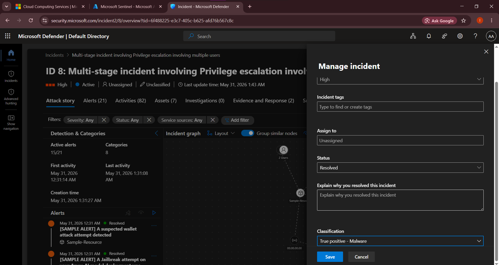

# 🛡️ Microsoft Sentinel & Cloud SOC Lab: Threat Hunting & Incident Response

## 📌 Project Overview

This project demonstrates a complete cloud security investigation using Microsoft Sentinel and Microsoft Defender for Cloud. The lab simulates a real-world multi-stage cyberattack where an adversary compromises user accounts, escalates privileges, and attempts to establish communication with malicious Command and Control (C2) infrastructure.

The objective was to perform incident triage, threat hunting, attack-path analysis, and remediation using security alerts, investigation graphs, and Kusto Query Language (KQL).

---

## 🎯 Project Objectives

* Investigate high-severity security incidents.
* Perform cloud-based threat hunting using KQL.
* Analyze attacker behavior and attack progression.
* Identify compromised assets and user accounts.
* Validate Indicators of Compromise (IoCs).
* Apply incident response and containment actions.
* Map attacker activity to the MITRE ATT&CK Framework.

---

# 🔍 Investigation Walkthrough

## Step 1: Incident Detection & Initial Triage

The investigation began from the Microsoft Defender Incidents Dashboard, where multiple high-severity alerts were automatically correlated into a single incident.

### Key Findings

* 9 security incidents detected.
* High-severity privilege escalation activity.
* Multiple users involved in the attack chain.
* Automated incident grouping by Microsoft Defender.

### Security Analyst Actions

* Reviewed incident severity and scope.
* Prioritized active threats.
* Initiated investigation workflow.

### Screenshot

```markdown


```

---

## Step 2: Attack Path Analysis Using Incident Graph

The Microsoft Sentinel Investigation Graph was used to visualize relationships between compromised assets, user identities, and malicious infrastructure.

### Findings

#### Compromised Resource

* Sample-Resource

#### Affected Identities

* Two user accounts involved in suspicious activity.

#### External Threat Indicator

* Outbound connection attempt to:

  * sample-malicious-url.com

### Security Analyst Actions

* Identified attack entry points.
* Mapped affected identities.
* Tracked attacker movement across the environment.
* Assessed potential blast radius.

### Screenshot

```markdown


```

---

## Step 3: Threat Hunting Using Kusto Query Language (KQL)

To validate the security alert and collect supporting evidence, threat hunting was performed using Microsoft Sentinel Logs.

### KQL Query

```kql
SecurityAlert
| where DisplayName has "sample-malicious-url.com"
| project TimeGenerated, AlertName, ProviderName
```

### Purpose

The query was designed to:

* Search for alerts containing the malicious domain.
* Validate Defender detections.
* Establish timeline evidence.
* Correlate alert activity with the incident.

### Screenshot

```markdown

```

---

## Step 4: Evidence Validation & Correlation

After reviewing the logs, evidence was correlated across security alerts, user activity, and cloud resources.

### Findings

* Multiple alerts referenced the malicious domain.
* Security events aligned with the privilege escalation timeline.
* User activity indicated potential account compromise.
* Incident evidence confirmed attempted external communication.

### Analyst Activities

* Alert validation.
* Event correlation.
* Timeline reconstruction.
* IOC verification.

### Screenshot

```markdown

```

---

## Step 5: Attack Chain Reconstruction

Based on collected evidence, the following attack sequence was identified.

### Attack Flow

1. Initial account compromise.
2. Privilege escalation.
3. Access to cloud resources.
4. Suspicious outbound communication.
5. Detection by Defender analytics.
6. Incident generation and escalation.

### Security Impact

* Identity compromise.
* Potential privilege abuse.
* Risk of command-and-control communication.
* Increased attack surface exposure.

### Screenshot

```markdown

```

---

## Step 6: MITRE ATT&CK Mapping

The observed activities were mapped to the MITRE ATT&CK framework.

| Tactic               | Technique                         |
| -------------------- | --------------------------------- |
| Initial Access       | Valid Accounts                    |
| Privilege Escalation | Abuse Elevation Control Mechanism |
| Credential Access    | Account Manipulation              |
| Discovery            | Account Discovery                 |
| Defense Evasion      | Permission Group Modification     |
| Command & Control    | Application Layer Protocol        |

### Screenshot

```markdown

```

---

## Step 7: Containment & Remediation

Following validation of the threat, incident response procedures were performed.

### Actions Taken

* Investigated affected user accounts.
* Revoked active sessions.
* Reset compromised credentials.
* Blocked malicious outbound connections.
* Reviewed role assignments.
* Verified environment integrity.
* Enabled continuous monitoring.

### Outcome

The threat was successfully contained and no evidence of additional persistence mechanisms was identified.

### Screenshot

```markdow 
```

---

# 🛠️ Technologies Used

* Microsoft Sentinel
* Microsoft Defender for Cloud
* Microsoft Defender XDR
* Log Analytics Workspace
* Kusto Query Language (KQL)
* Azure Security Center
* MITRE ATT&CK Framework

---

# 💡 Skills Demonstrated

### Security Operations (SOC)

* Incident Triage
* Alert Investigation
* Threat Hunting
* Incident Response
* Security Monitoring

### Cloud Security

* Microsoft Azure Security Monitoring
* Cloud Threat Detection
* Identity Investigation
* Attack Path Analysis

### Detection Engineering

* KQL Query Development
* IOC Validation
* Event Correlation
* Log Analysis

### Threat Intelligence

* C2 Infrastructure Identification
* MITRE ATT&CK Mapping
* Adversary Behavior Analysis

---

# ✅ Project Outcome

This lab successfully demonstrated the end-to-end investigation of a simulated cloud attack using Microsoft Sentinel and Microsoft Defender technologies.

The exercise involved identifying privilege escalation activity, validating malicious outbound communications, correlating security events, reconstructing the attack chain, and implementing remediation actions.

This project highlights practical SOC analyst capabilities in cloud threat detection, threat hunting, incident investigation, and security operations within enterprise Microsoft environments.


